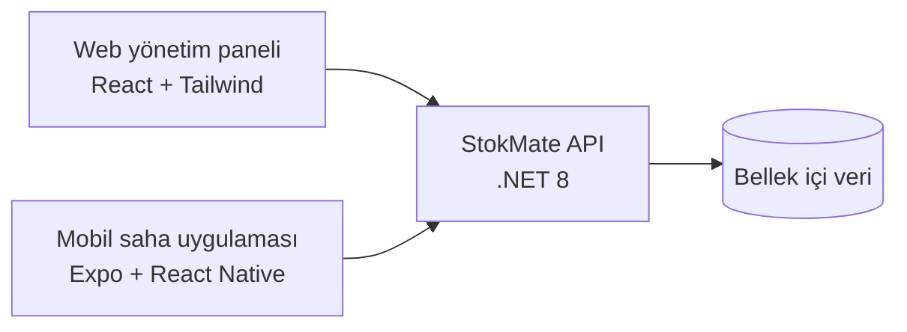

# StokMate Case

StokMate; merkez ofis çalışanlarının ürün kataloğunu webden yönettiği, mağaza personelinin ise aynı ürünlerin stoklarını mobil uygulamadan güncellediği bir iç araçtır. Web ve mobil uygulama aynı .NET API’yi kullanır.

## İçerik

| Uygulama | Teknoloji | Sorumluluk |
| --- | --- | --- |
| `apps/api` | .NET 8 Web API | Kimlik doğrulama, ürün ve katalog verisi |
| `apps/web` | React + TypeScript + Tailwind CSS | Merkez ofis yönetim paneli |
| `apps/mobile` | Expo + React Native + TypeScript | Mağaza saha uygulaması |



## Özellikler

### Web

- Access/refresh token tabanlı giriş ve oturum yönetimi
- Arama, kategori/marka/durum filtresi, sıralama ve sayfalama
- Seçili filtrelerin URL’de saklanması; detaydan listeye dönüldüğünde korunması
- Aktif filtre etiketleri ve tek tek/toplu temizleme
- Ürün detayında tüm ürün alanlarını güncelleme
- Kaydedilmemiş değişiklik uyarısı, yükleniyor/hata/boş durumları ve başarı bildirimi
- Liste ve düzenlenmeyen ürün detayında 8 saniyelik arka plan yenilemesi

### Mobil

- Expo Go, iOS Simulator ve Android emülatör/cihazda çalışabilen giriş akışı
- Arama, taslak filtreleme ve sıralama; seçimler yalnızca **Uygula** ile listeye yansır
- Aktif filtre etiketleri, aşağı çekerek yenileme ve “Daha fazla göster” sayfalaması
- Web ile aynı stok, durum, fiyat ve minimum stok gösterimi
- Ürün detayında ad, stok kodu, fiyat, stok, kategori, marka, tedarikçi, durum ve ek alanları güncelleme
- Dokunarak açılan ortak seçim alanları; kaydedilmemiş değişikliklerde uygulama içi onay modali
- Düzenlenmeyen detay ekranında ve listede 8 saniyelik arka plan yenilemesi

## Nasıl çalıştırılır

### Gereksinimler

- .NET SDK 8+
- Node.js 20.19.4+
- npm
- Mobil iOS simülatörü için Xcode ve iOS runtime; fiziksel cihaz için Expo Go

Projeyi klonladıktan sonra bağımlılıkları yükleyin:

```bash
cd StokMateCase

cd apps/web && npm install
cd ../mobile && npm install
```

### 1. API’yi başlatın

Proje kökünden:

```bash
npm run dev:api
```

veya:

```bash
dotnet run --project apps/api/src/StokMate.Api
```

Swagger: [http://localhost:5080/swagger](http://localhost:5080/swagger)

### 2. Web uygulamasını başlatın

```bash
cd apps/web
cp .env.example .env
npm run dev
```

Web varsayılan olarak [http://localhost:5173](http://localhost:5173) adresinde açılır. API adresi `apps/web/.env` içindeki `VITE_API_BASE_URL` ile değiştirilebilir.

### 3. Mobil uygulamayı başlatın

Fiziksel cihaz için önce ortam değişkenini hazırlayın:

```bash
cd apps/mobile
cp .env.example .env
```

`.env` içindeki `EXPO_PUBLIC_API_URL` değerini bilgisayarınızın yerel ağ IP’si ile değiştirin. Örnek:

```dotenv
EXPO_PUBLIC_API_URL=http://192.168.1.25:5080
```

Ardından:

```bash
npm start
```

- Telefonda Expo Go ile QR kodunu okutun. Telefon ve bilgisayar aynı Wi-Fi ağında olmalıdır.
- iOS Simulator için `npm run ios` komutunu kullanın.
- Android emülatörü için `npm run android` komutunu kullanın.

> iOS Simulator’da API için `localhost` kullanılabilir. Fiziksel cihazda `localhost` cihazın kendisini ifade ettiği için bilgisayarın yerel IP adresi gerekir.

### Test kullanıcısı

```text
E-posta: test@ornek.com
Şifre: Test1234!
```

## Klasör yapısı

Web ve mobilde ortak kavramlar aynı isimlerle gruplanmıştır; platforma özgü fark olarak web `pages`, mobil ise `screens` kullanır.

```text
apps/web/src/
├── components/{feedback,ui}
├── hooks
├── lib/api
├── pages/{Login,ProductList,ProductDetail}
├── providers
├── types
└── utils

apps/mobile/src/
├── components/{feedback,ui}
├── hooks
├── lib/api
├── navigation
├── providers
├── screens/{Login,ProductList,ProductDetail}
├── types
└── utils
```

## Varsayımlar

- Verilen API bellek içi veri kullanır; API yeniden başlatıldığında yapılan değişiklikler sıfırlanır.
- API, geliştirme ortamında hem web hem fiziksel cihaz erişimi için `0.0.0.0:5080` üzerinde çalışır. CORS ayarı geliştirme amaçlı açıktır.
- Sağlanan API’de ürün detayını tek başına getiren bir uç bulunmadığından, detay verisi ürün listesi üzerinden bulunur.
- Eşzamanlı güncellemeleri görünür kılmak için liste ve kaydedilmemiş değişiklik olmayan detay ekranları 8 saniyede bir kontrol edilir. Kullanıcı formda düzenleme yaparken gelen veri formun üzerine yazılmaz.
- Webde filtreler URL ile paylaşılabilir ve geri dönüşte korunur. Mobilde aynı oturum içindeki ekran geçişlerinde korunur; mobil URL kavramı olmadığı için paylaşılabilir bağlantı üretilmez.
- Mobil liste, küçük ekran davranışına uygun olarak numaralı sayfalar yerine art arda ürün yükleyen “Daha fazla göster” yaklaşımını kullanır.

## Kütüphaneler ve tercih nedenleri

| Kütüphane / teknoloji | Kullanım nedeni |
| --- | --- |
| React + TypeScript | Bileşen tabanlı yapı, güvenli veri modelleri ve hızlı geliştirme |
| React Router | Webde korumalı sayfalar ve liste/detay yönlendirmesi için hafif çözüm |
| Tailwind CSS | Web arayüzünde tasarım tokenlarını ve tekrar eden stilleri tutarlı yönetmek için |
| Vite | Hızlı geliştirme sunucusu ve üretim derlemesi |
| Vitest | Yardımcı fonksiyonların hızlı birim testi |
| Expo + React Native | Tek kod tabanıyla iOS/Android geliştirme, Expo Go ile cihazda hızlı doğrulama ve EAS ile APK üretimi |
| `@expo/vector-icons` | Platformla uyumlu gerçek ikonlar için |
| `react-native-safe-area-context` | iOS/Android güvenli ekran alanlarını platforma uygun yönetmek için |
| AsyncStorage | Mobil oturum bilgisini cihazda saklamak için |
| .NET 8 | Verilen backend altyapısı; hafif, hızlı Web API çalıştırma ortamı |

Ek olarak, harici bir state yönetim kütüphanesi kullanılmadı. Uygulama kapsamı için React state/context yeterli kaldı; bu sayede bağımlılık ve soyutlama miktarı düşük tutuldu.

## Kontroller

```bash
# Web: üretim derlemesi ve birim testleri
cd apps/web
npm run build
npm test

# Mobil: TypeScript kontrolü
cd ../mobile
npm run typecheck

# API: derleme
cd ../..
npm run build:api
```

## APK üretimi

Hazır preview APK:

[StokMate Android APK indir](https://expo.dev/accounts/sevozkan/projects/stokmate/builds/5a699bf9-811f-4f89-bd59-53ecc45188fb)

> Bu EAS indirme bağlantısı geçicidir; 8 Eylül 2026 tarihine kadar kullanılabilir. Kalıcı teslim için APK dosyasını Drive veya GitHub Release üzerinden de paylaşabilirsiniz.

Expo/EAS hesabıyla Android APK üretmek için:

```bash
cd apps/mobile
npx eas-cli build --platform android --profile preview
```

Komut, Expo hesabıyla oturum açmanızı ister ve işlem sonunda indirilebilir APK bağlantısı sağlar.
